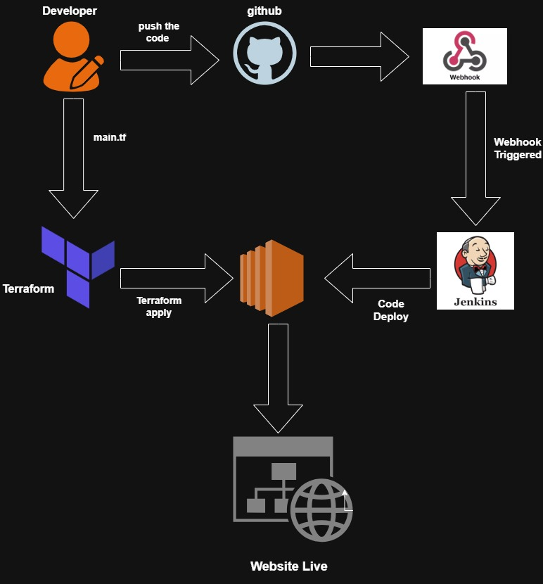
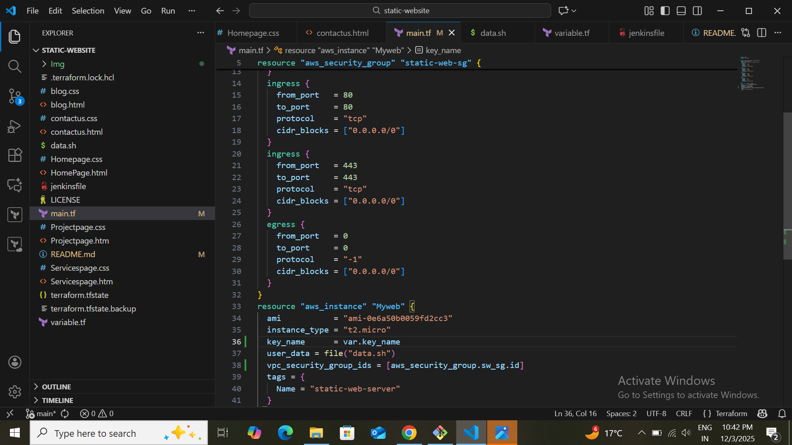
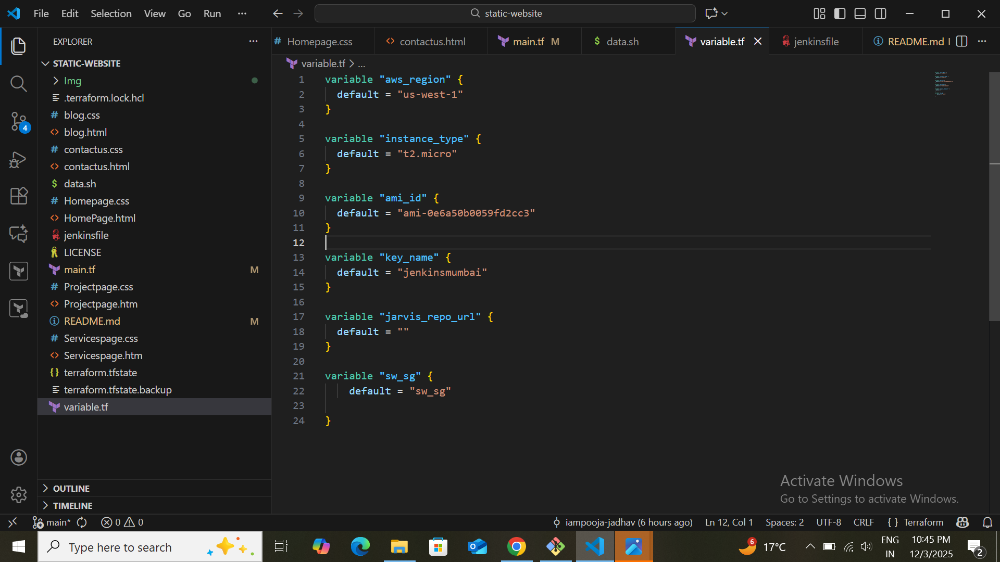
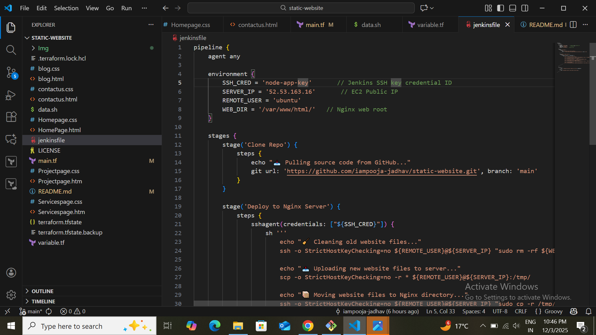
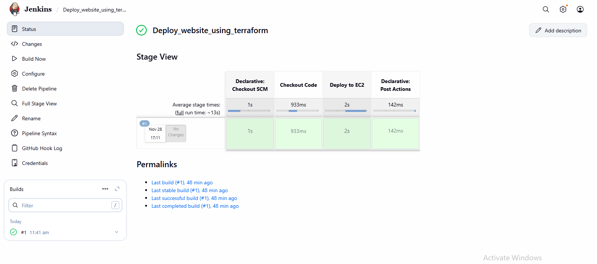
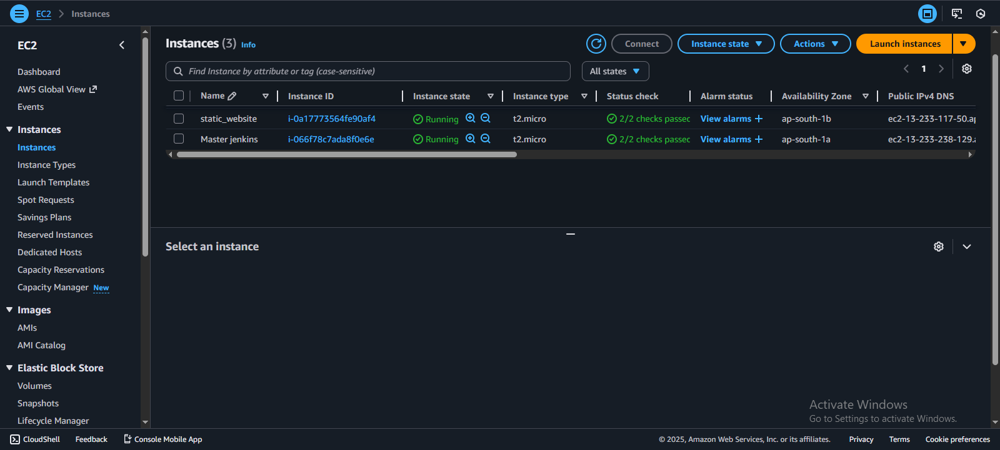
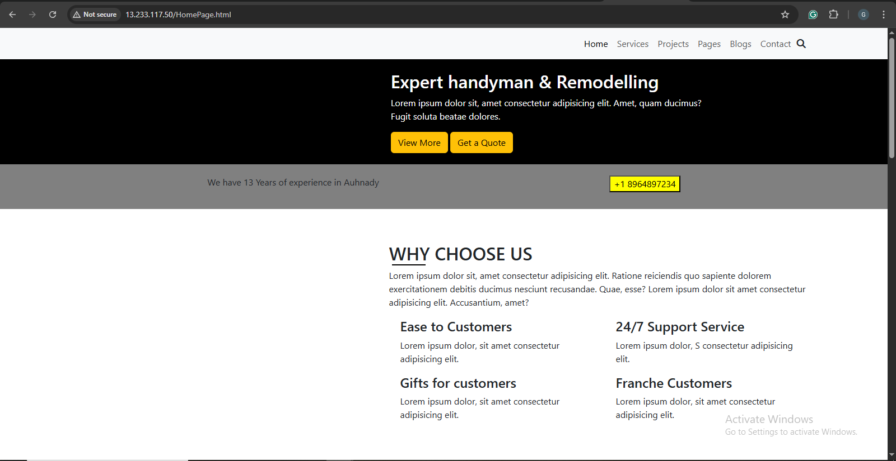
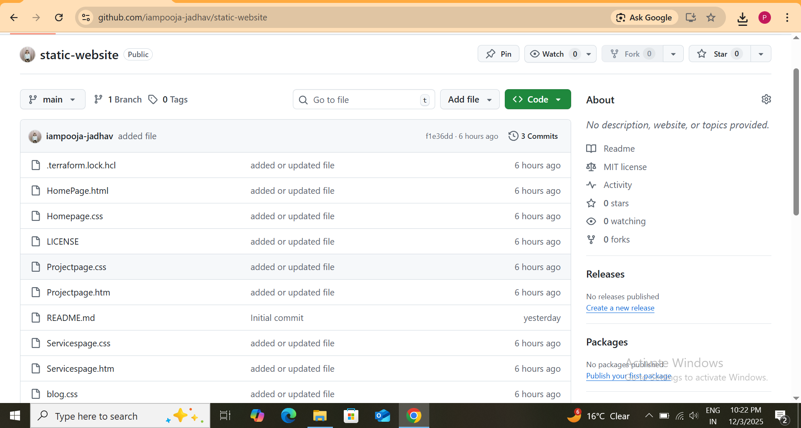

# Deploy a Static Website using Terraform, AWS EC2 & Jenkins

#### Automated CI/CD Pipeline for hosting a static website using Terraform, AWS EC2, Apache, and Jenkins.
#### Whenever code is pushed to GitHub, Jenkins automatically deploys the latest version to the EC2 instance.

## Project Overview
### This project demonstrates how to:

- Provision AWS EC2 using Terraform
- Install and configure Apache automatically using User Data
- Host a static website on EC2
- Automate deployments using Jenkins CI/CD
- Integrate GitHub Webhooks for automatic build triggers

## Architecture

### Technologies Used
- Terraform (Infrastructure as Code)
- AWS EC2
- Ubuntu AMI
- Apache Web Server
- Jenkins
- Git & GitHub
- CI/CD Pipeline
- SSH Deployment
- Linux

## Terraform Deployment
### Terraform creates:

- EC2 instance
- Security Group (Ports 22 & 80 open)
- Apache installation via User Data
- Clones GitHub repo into /var/www/html

## main.tf

## variable.tf

## Run Terraform
>terraform init

>terraform apply -auto-approve

### Jenkins CI/CD Pipeline

#### ✔ Triggered by GitHub Webhook

Whenever you push code → Jenkins pipeline starts automatically.

### ✔ Pipeline Stages
- Clone repository
- SSH into EC2
- Clean old website code
- Clone fresh code from GitHub
- Restart Apache
- Website gets updated instantly

## Jenkinsfile

### EC2 Auto-Configuration (User Data Script)
#### Your EC2 User Data installs:

- Apache
- Git
- Pulls your static website automatically

## Screenshots
### 1. Jenkins Pipeline

### 2. EC2 Instance

### 3. Website output

### 4. Terraform Apply

### 5. Github repo

## What I Learned (Key Skills)
🔹 Cloud (AWS)

- EC2 provisioning
- IAM roles
- Security Groups
- Automated deployments

🔹 DevOps
- Jenkins Pipelines
- GitHub Webhooks
- SSH deployment
- CI/CD automation

🔹 Terraform

- EC2 provisioning
- VPC & Networking
- User Data automation

🔹 Linux

- Apache web server
- Shell scripting
- Permissions & ownership

## Conclusion

### This project shows how Terraform makes deploying a static website simple, automated, and consistent by managing all required AWS resources through Infrastructure-as-Code.

## Author
Pooja Jadhav

Cloud & DevOps Enthusiast

GitHub:https://github.com/iampooja-jadhav

Gmail: jadhavpooja8797@gmail.com
